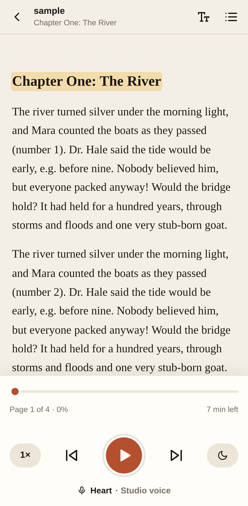
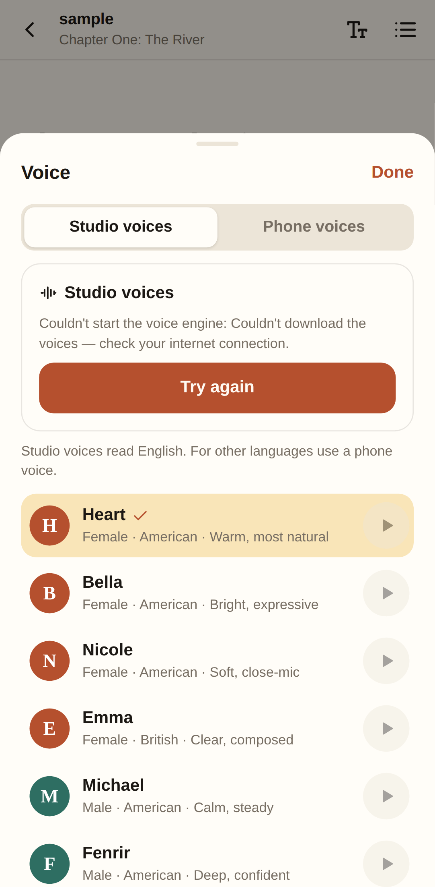
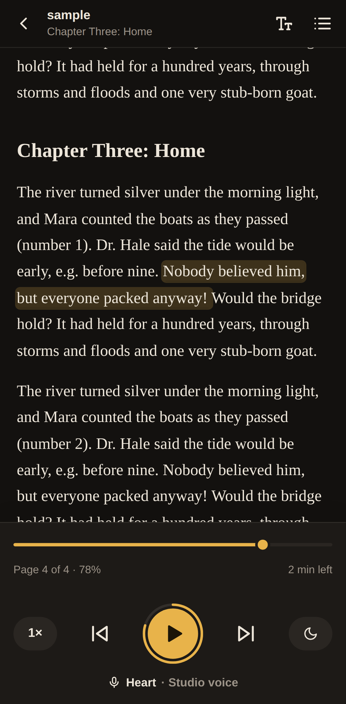

# Flybook

Turn any PDF into an audiobook, right in the browser. Built for phones.

<p>
  
  
  
  
</p>

- **No login, no server.** The PDF is read on the device with pdf.js, and the
  library and reading position are saved in the browser (IndexedDB).
- **Good voices, generated on the device.** "Studio voices" run the open
  [Kokoro-82M](https://huggingface.co/hexgrad/Kokoro-82M) model inside a Web
  Worker (kokoro-js / ONNX Runtime Web). The model is a one-time download of
  about 90 MB, cached afterwards, and works offline. The phone's built-in
  voices are available as an instant fallback.
- **Audiobook controls.** Follow-along highlighting, tap any sentence to jump
  there, chapters (from the PDF outline, detected headings, or page ranges),
  speed, a sleep timer, lock-screen/headphone controls, and resume where you
  left off.
- **Installable (PWA).** Works offline after the first visit.

## Develop

```bash
npm install
npm run dev        # http://localhost:5173
npm test           # text-extraction unit tests
npm run build      # static site in dist/
```

## Deploy

`dist/` is a plain static site, so any static host works.

- **GitHub Pages:** `.github/workflows/deploy.yml` builds and deploys on every
  push to `main` (or the current default branch). Enable it under
  *Settings → Pages → Source: GitHub Actions*. On a free GitHub plan, Pages
  requires the repository to be public.
- **Netlify / Cloudflare Pages / Vercel:** build command `npm run build`,
  output directory `dist`. `public/_headers` and `vercel.json` set the
  cross-origin isolation headers.

Voice generation is much faster with several CPU threads, which needs
cross-origin isolation. On hosts that can't set headers (GitHub Pages), the
service worker adds them itself and reloads the page once on the first visit.

## How it works

| Piece | File |
| --- | --- |
| PDF → lines (pdf.js, legacy build for older phones) | `src/lib/pdf.ts` |
| Header/footer removal, paragraphs, sentences, chapters | `src/lib/text.ts` |
| Kokoro model in a Web Worker | `src/tts/kokoro.worker.ts`, `src/tts/kokoro.ts` |
| Playback engine: generates a few sentences ahead, Media Session | `src/tts/narrator.ts` |
| Phone voices (Web Speech API) | `src/tts/system.ts` |
| Library / reader UI | `src/components/` |

## Known limits

- Scanned PDFs (images only, with no text layer) aren't supported yet. They
  need on-device OCR (for example tesseract.js).
- Studio voices speak English (US and UK). For other languages, use a phone
  voice.
- On older or low-end phones, Kokoro can generate audio slower than real time,
  which causes short pauses between sentences. Phone voices never pause.
- iOS may pause generation while the screen is locked. Playback continues with
  the sentences already prepared.
